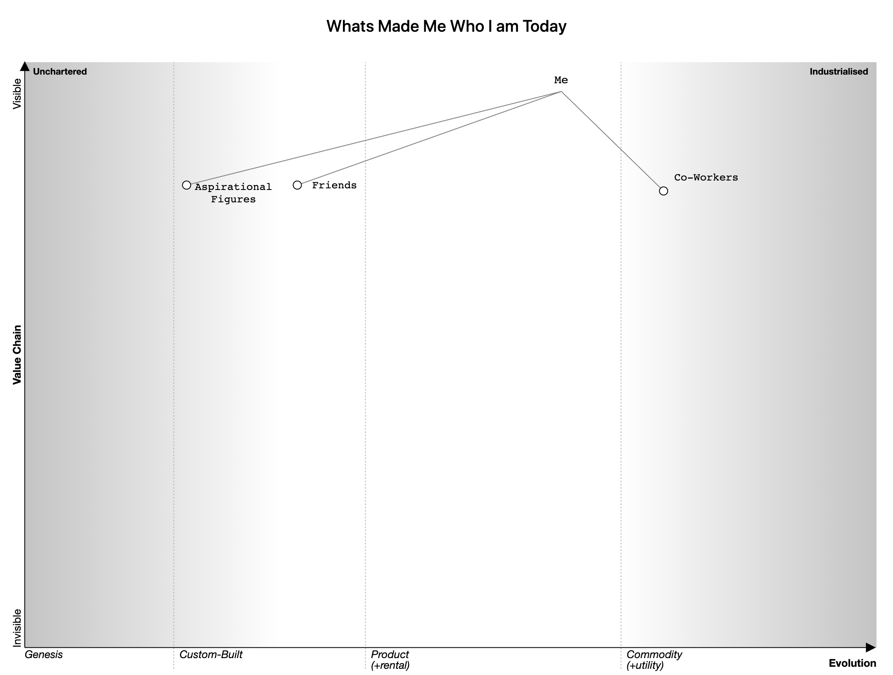
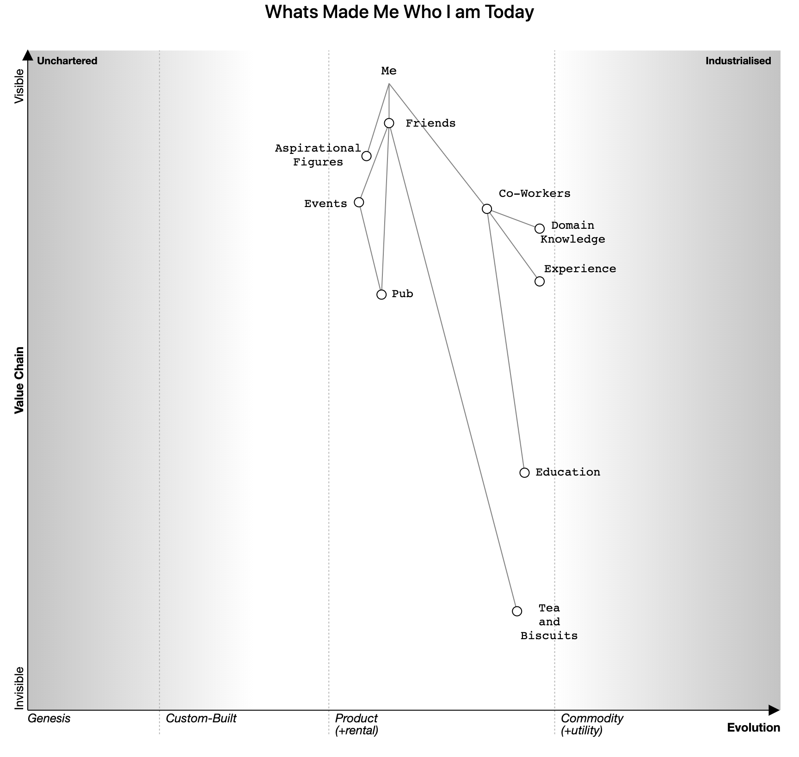
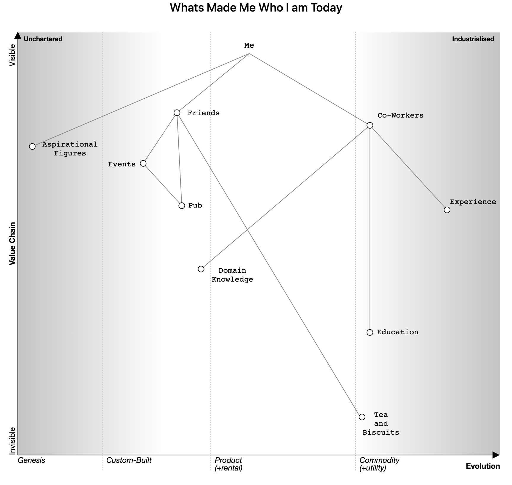
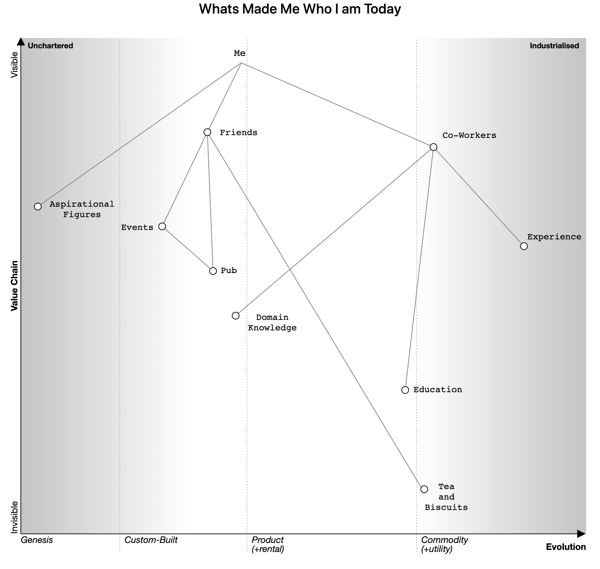
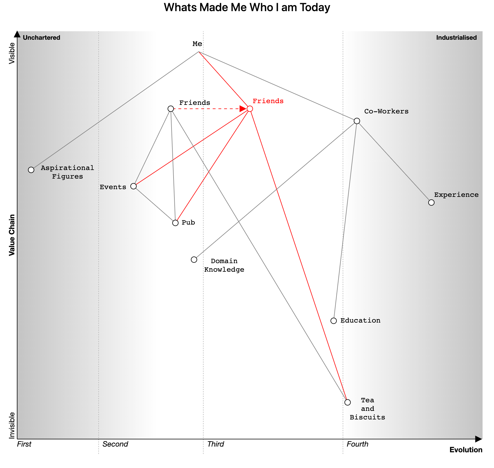

# Wardley Map
I would watch Simon Wardley mapping videos, however not understand the purpose of Wardley Maps. I realised after rewatching his content, that before I lacked a need of a strategy or a story to tell.

I understood that you can explain 'how to get to a location' via explaination by means of telling a story, and also a visual representation. In Szu Tzu's case it was to think, to strategise warfare. In Simon Wardley's case it was business strategy.

In my case it is to get through the hiring process to obtain the Developer Team Lead role.

## What to Wardley Map?
This was a difficult question for me to answer. I thought about problems I could attempt to solve via wardley maps:

- Glasswall Marketing?
- Automating Toil?

I thought whats the most complex system to impress? To accomplish my  goal... A human beings mind, the phsycology. Myself.

## This is my Story

## My Approach to this Map
I've seen Wardley create his maps after creating the value chain first then developing further via evolution axis. I shall follow in a similar way by piecing the valued items and rearanging towards the end.

### Mapping the Most Complex System - Me

I’m a very personal, people driven person. For that reason I would then say I depend on <b>Friends</b>. <b>Aspirational Figures</b> I look up to and desire to obtain certain traits. Finally considering work takes up a significant portion of my day and also contains a subset of aspiration figures, I have <b>Co-Workers</b>.

#### Friends 
| Value Position Justification | Evolution Justification |
| --- | --- |
| I’ll never meet anyone quite like the friends I have. The value they have to me is an amount undescribable. High Value | They’re one of a kind, and like with a custom built system. It works and I've invested a great amount of time and wouldn’t want to change. Custom Built. |

#### Aspirational Figures 
| Value Position Justification | Evolution Justification |
| --- | --- |
| The value these people have to me I regard quite highly, some research showed me Shakespeare first used the word 'Aspiration' to denote 'filling ones lungs' and upward desire. <i>"When you want to Succeed as Bad as you want to Breathe, then you'll be successful"</i> - Eric Thomas | I view them as one of a kind, different, knowledgeable in similar interests. Arguably they could be in custom built or genesis due to the time and effort devoted in their fields and are hard to find. Again a subset of co-workers so visible but a little less. |

#### Co-Workers
| Value Position Justification | Evolution Justification |
| --- | --- |
| The value of these people is high due to the knowledge I can gain from these people. Through interaction and answering questions alot can be learnt. | This is software developers, sales, management, etc. This can be a vast amount of people as everyone has the potential to be a co-worker, to classify someone as a co-worker they have the desire to meet the company needs, and work alongside. |

## Start Again
At this point I had then added 3 more components. I believed it didn't reflect my story well. So I reverted to Wardleys approach of developing a value chain first. I understood it does not have to make sense first time round to solve the problem.
I view the purpose of mapping to tell your current story, and then depict how you would solve the problem by strategy and mapping.

### Phase 2 - Map out Value Chain Position

### Phase 3 - Map out Evolution

#### Events
| Value Position Justification | Evolution Justification |
| --- | --- |
| Events with friends are high valued. Whether it's travelling, visits to the pub and other past times, it's a way to let loose. | Events with friends are meaningful and fun, typically travel to places we have never been before, or even visiting the local pub or trying new pubs. |

#### Pub
| Value Position Justification | Evolution Justification |
| --- | --- |
| Lower in value than events however does provide a great social space. | All pubs are custom built. Every weatherspoons has a different unique style of carpet, has been productised however so this is debateable. |

#### Tea and Biscuits
| Value Position Justification | Evolution Justification |
| --- | --- |
| Inspired by Wardleys example, my friends have a great love for tea I cannot explain. To me there is no value in this... I'm not an avid tea supporter, let alone make a cup of tea. | Large brand tea such as Twinnings and Yorkshire Gold. Already a product that people need as demonstrated by my friends. |

#### Domain Knowledge
| Value Position Justification | Evolution Justification |
| --- | --- |
| Co-Workers of high experience have spent vast amounts of time learning and their knowledge makes them valuable to a company. | CDR knowledge is hard to come by. Not only is knowledge on file formats is important but also how to apply that knowledge. |

#### Experience
| Value Position Justification | Evolution Justification |
| --- | --- |
| Experience is an asset to a company. Experience accredits a worker and due to the amount of time spent experiencing work than education it becomes more valuable. | Everyone face working experince. This is dependant on the co-worker and the time they have spent in work. |

#### Education
| Value Position Justification | Evolution Justification |
| --- | --- |
| Particularly in the field of Computer Science, Programming etc, the amount of time in education was very limited, valuable, however most would say they have learnt more through experience than education. | In this context I refer to education as school education. The education taught is verified by everyone and taught to classes nationally. Including university education. It is specific to each university however the items taught can remain unchanged and taught to many others. This could be in product due to it's wide variety of universitys and ways it can be taught and also tuition fees productise education. |

### Phase 4 - Final Amendments

### Phase 5 - Strategy to Achieve Role (Should I Fail)

I could eveolve my friends... I hope you're not reading this. My strategy could be to change friends, to make them more familiar with my particular professional field of technology.
Friends who are great influences in my life could be more related to my goals.

## Code Used

    title Whats Made Me Who I am Today
    anchor Me [0.95, 0.39]
    component Friends [0.81, 0.33] label [15, -7]
    component Co-Workers [0.78, 0.73] label [13, -13]
    component Aspirational Figures [0.66, 0.03] label [34, -10]

    component Tea and Biscuits [0.09, 0.71]
    component Pub [0.53, 0.34] label [11, 3]
    component Events [0.62, 0.25] label [-59, 5]

    component Experience [0.58, 0.89]
    component Education [0.29, 0.68] label [12, 3]
    component Domain Knowledge [0.44, 0.38] label [23, -4]

    Me->Friends
    Me->Aspirational Figures
    Me->Co-Workers

    Friends->Events
    Friends->Pub
    Friends->Tea and Biscuits
    Co-Workers->Education
    Co-Workers->Experience
    Co-Workers->Domain Knowledge
    Events->Pub

    evolve Friends 0.5

    style wardley
